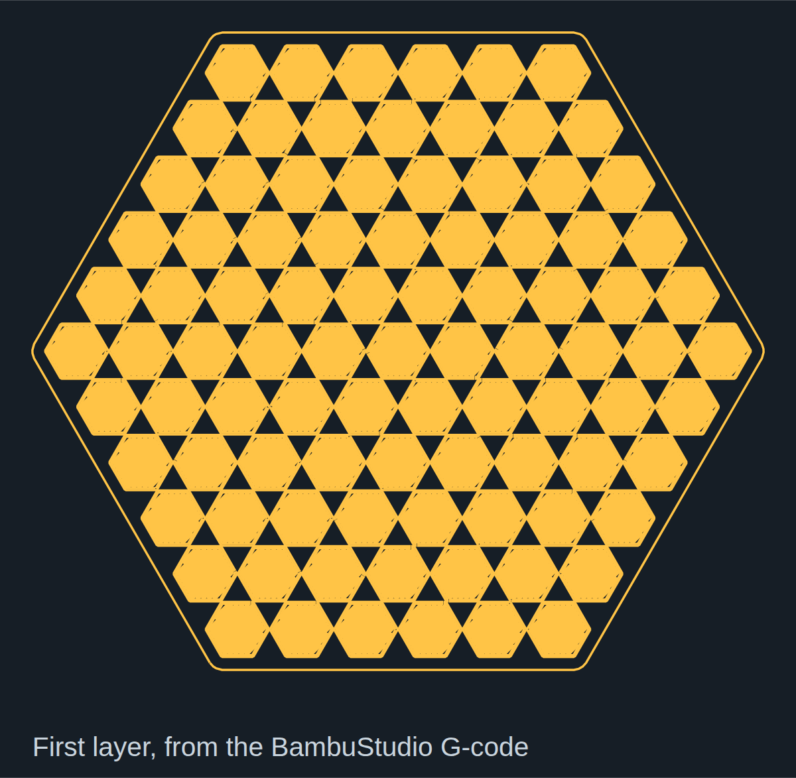
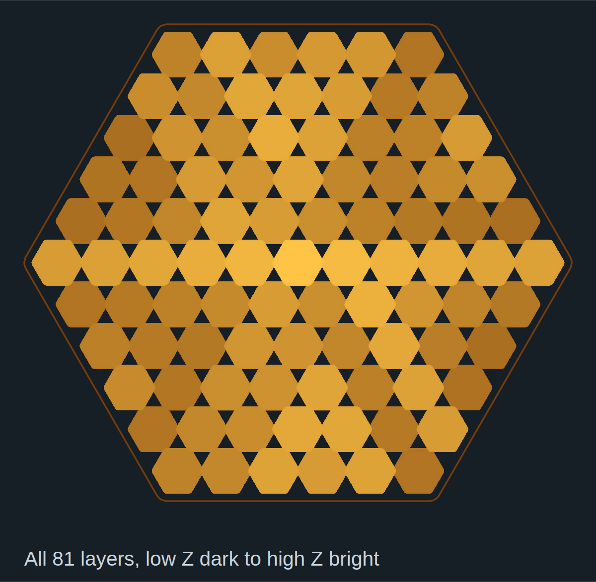

# From Blender geometry to a BambuStudio plate

This run turns a Blender scene into a sliced, local print artifact. Nothing here was sent to a printer.

## 1. Build and export in Blender

The hive-blender socket transport drove Blender 5.2 (Flatpak). A CodeGate-confirmed `execute_code` built a scene with 91 beveled hexagonal slabs; `get_scene_info` reported 102 objects. The export call used `bpy.ops.wm.stl_export(..., export_selected_objects=True, apply_modifiers=True, global_scale=10.0)` on the slab meshes. The STL is about 130 mm wide. Without source-side scaling, Blender units exported at about 13 mm for this model. The staged Blender images below are from that run.


`hive-blender` `execute_code` built the hexagonal geometry and staged its materials and viewport.


`hive-blender` `execute_code` produced the final staged Blender scene before STL export.

## 2. Slice with hive-bambu

`bambu-slicer` `presets` lists installed stock BBL profiles. The `slice` call takes a fingerprinted model (see `hive-bambu.slicer.domain/artifact`) and a printer/process/filament preset. `FlatpakCliSlicer` then runs the installed `com.bambulab.BambuStudio` Flatpak CLI, writes a new per-run output folder and reads estimates from the resulting `.gcode.3mf`.

```json
{"command":"slice","request":{"model":{"path":"/absolute/path/hive-geometry-slab-130mm.stl","format":"stl","sha256":"<sha256 from artifact>","bytes":746284},"preset":{"printer":"Bambu Lab X1 Carbon 0.4 nozzle.json","process":"0.20mm Standard @BBL X1C.json","filament":"Bambu PLA Basic @BBL X1C.json"}}}
```

Use the actual `artifact` return fields rather than copying the placeholder path or size. The run took **15.1 s**, wrote a **3.14 MB** archive, and estimated **9,822 s** (about 2 h 44 min) and **19.4 m** of filament. The sliced archive reports 81 layers and 0 grams because its profile records zero density; grams are not a reliable estimate in this run. `bambu-slicer` `export` can package a model, its sliced project and an order sheet for a third-party print service. It does not submit an order.



`bambu-slicer` `slice` generated `output.gcode.3mf`; this plate image plots positive-extrusion `G1` moves in its first `Metadata/plate_1.gcode` layer on the 256 mm bed. It is **not** an embedded BambuStudio preview. We inspected the actual archive: it contains G-code and slice metadata, but **no PNG thumbnail**. To reproduce the image from that archive without launching any GUI:

```sh
unzip -p output.gcode.3mf Metadata/plate_1.gcode > plate_1.gcode
bb dev/showcase/render_plate.clj plate_1.gcode out/
chromium --headless --hide-scrollbars --window-size=1200,1173 \
  --screenshot=$PWD/out/plate-first-layer.png "file://$PWD/out/plate-first-layer.svg"
```

The renderer splits layers at `; CHANGE_LAYER` and draws only extruding XY segments (a `G1` with positive relative E). It does not draw travel moves or simulate nozzle width or material color. It also writes `plate-all-layers.svg`, every layer stacked from low Z (dark) to high Z (bright):



The brighter slabs are the taller ones: the slab heights the Blender run computed survive the export and the slice. We used the large hive slab archive at `~/.cache/hive-craft-bambu/out/e550de4e-0a40-411f-b2f9-60580b23c862/output.gcode.3mf` to make this image. The small `test/fixtures/slice-info.gcode.3mf` is metadata only and has no image.

## 3. Keep printing separate

A completed slice is a file, not an instruction to print. Mounting `hive.bambu` requires a config-declared `:print-gate`; `bambu` `call` refuses `print.project_file` rather than sending it directly. The base addon has no live printer transport. `bambu` `catalog` and `doctor` let an agent inspect the command vocabulary and the transport state without implying a printer connection. See the [README](../../README.md#try-it) for the config and a starting call.

## Where the other craft tools fit

PhotoCraft made the separate *hive geometry* 2D art through its control channel. VectorCraft drew a separate golden-comb vector study using its control channel. Those images are parallel visual explorations, not toolpaths or input to this STL. The physical path in this showcase is **Blender scene → source-scaled STL → hive-bambu slice → local `.gcode.3mf` and estimates**. No printer execution was verified.
